# LINK DA APRESENTAÇÃO

https://drive.google.com/file/d/1YnPTOWRMnsW291v9dAaMtU49sEKE_QN4/view

https://app.powerbi.com/view?r=eyJrIjoiYTE1M2IxNDEtMmY0OC00ZDZiLWFjMjMtMWI1ODFkZDgyOWJjIiwidCI6IjRhNWRiNDI3LTllNTgtNDQ5MC04ZDY4LWYxOWJlYjRiNzlmMCJ9

https://www.loom.com/share/4142893d432e4b7daec5ae6aeb1f1eae


# DOCUMENTAÇÃO

## Objetivo:

Este projeto tem o objetivo de validar ou refutar as hipóteses a partir da análise de dados afim de fornecer as melhores estratégias para que a gravadora e o novo artista tomem decisões que aumentem suas chances de alcançar o “sucesso”.

## Case

Num mundo onde a **indústria musical** é extremamente competitiva e em constante evolução, a capacidade de tomar decisões baseadas em dados tornou-se um ativo inestimável.

Neste contexto, uma gravadora enfrenta o emocionante desafio de lançar um novo artista no cenário musical global. Felizmente, ela tem uma ferramenta poderosa em seu arsenal: um extenso conjunto de dados do Spotify com informações sobre as músicas mais ouvidas em 2023.

- A gravadora levantou uma série de hipóteses sobre o que faz uma música seja mais ouvida. Essas hipóteses incluem:
- Músicas com BPM (Batidas Por Minuto) mais altos fazem mais sucesso em termos de número de streams no Spotify.
- As músicas mais populares no ranking do Spotify também possuem um comportamento semelhante em outras plataformas, como a Deezer.
- A presença de uma música em um maior número de playlists está correlacionada com um maior número de streams.
- Artistas com um maior número de músicas no Spotify têm mais streams.
- As características da música influenciam o sucesso em termos de número de streams no Spotify.

## Links de interesse:

[https://app.powerbi.com/view?r=eyJrIjoiYTE1M2IxNDEtMmY0OC00ZDZiLWFjMjMtMWI1ODFkZDgyOWJjIiwidCI6IjRhNWRiNDI3LTllNTgtNDQ5MC04ZDY4LWYxOWJlYjRiNzlmMCJ9](https://app.powerbi.com/view?r=eyJrIjoiYTE1M2IxNDEtMmY0OC00ZDZiLWFjMjMtMWI1ODFkZDgyOWJjIiwidCI6IjRhNWRiNDI3LTllNTgtNDQ5MC04ZDY4LWYxOWJlYjRiNzlmMCJ9)

## 1.Pré

**1.1-** Criar o bigquery por sandbox.

[https://www.youtube.com/watch?v=z32438Yehl4&list=PL5TJqBvpXQv5n1N15kcK1m9oKJm_cv-m6&index=3](https://www.youtube.com/watch?v=z32438Yehl4&list=PL5TJqBvpXQv5n1N15kcK1m9oKJm_cv-m6&index=3)

**1.2-** Baixar as planilhas na plataforma em zip e extrair arquivos no desktop

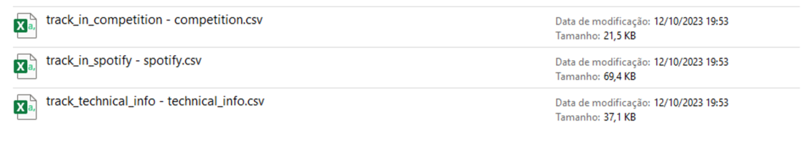

## **2. Processar e preparar a base de dados**

### 2.1- Conectar/importar dados para as ferramentas

**2.1.1-** Subr as planilhas no bigquery, preservando seus nomes, colocando-as no dataset projeto2.

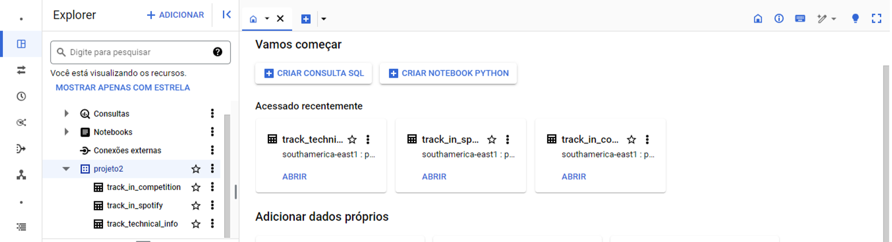

### 2.2- Identificar e tratar valores nulos

**2.2.1-** Usar COUNT(*) WHERE e IS NULL no BigQuery de pasta a pasta pra testar cada uma delas e formular tabelas de nulos.

**2.2.2-** Como exemplo,  a tabela track_in_competition, do dataset projeto2, selecionando a tabela e em seguida usando as ferramentas para consultar as colunas, no caso, a coluna in_shazam_charts, onde foram conferidos 50 nulos:

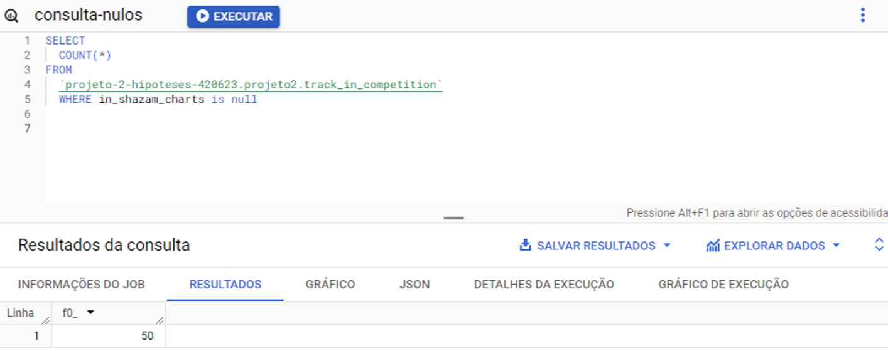

**2.2.3-** Tabela de nulos:

track_technical_info

| coluna | nulos |
| --- | --- |
| track_id | 0 |
| bpm | 0 |
| key | 95 |
| mode | 0 |
| danceability__ | 0 |
| valence__ | 0 |
| energy__ | 0 |
| acousticness__ | 0 |
| instrumentalness__ | 0 |
|  liveness__ | 0 |
| speechiness__ | 0 |

track_in_spotify

| coluna | nulos |
| --- | --- |
| track_id | 0 |
| track_name | 0 |
| artist_s__name | 0 |
| artist_count | 0 |
| released_year | 0 |
| released_month | 0 |
| released_day | 0 |
| in_spotify_playlists | 0 |
| in_spotify_charts | 0 |
| streams | 0 |

track_in_competition

| coluna | nulos |
| --- | --- |
| track_id | 0 |
| in_apple_playlists | 0 |
| in_apple_charts | 0 |
| in_deezer_playlists | 0 |
| in_deezer_charts | 0 |
| in_shazam_charts | 50 |

### 2.3- Identificar e tratar valores duplicados

**2.3.1-**  ****Por se tratar de uma base de dados que possui um id_track que pode ser igual mesmo sendo de artistas diferentes, agrupei pela o “nome da música” e “artista da música”:

```sql
track_name
artist_s__name
```

No BigQuery abri uma nova Query pelo dataset projeto2,  tabela track_in_spotify e usando GROUP BY pedi um COUNT(*) e GROUP BY:

```sql
SELECT 
track_name,
artist_s__name,
COUNT(*)
FROM `projeto-2-hipoteses-420623.projeto2.track_in_spotify`
GROUP BY track_name,artist_s__name
```

A query me devolveu uma tabela agrupada com a track e nome do artista e uma última coluna com a contagem. Mas para descobrir quantas apareciam mais de uma vez, usei HAVING COUNT(*)

```sql
SELECT 
track_name,
artist_s__name,
COUNT(*)
FROM `projeto-2-hipoteses-420623.projeto2.track_in_spotify`
GROUP BY track_name, artist_s__name
HAVING COUNT(*) > 1
```

E tive o seguinte resultado, confirmando 4 músicas, sendo do mesmo artista, duplicadas:

| Linha | track_name | artist_s__name | f0_ |
| --- | --- | --- | --- |
| 1 | SNAP | Rosa Linn | 2 |
| 2 | About Damn Time | Lizzo | 2 |
| 3 | Take My Breath | The Weeknd | 2 |
| 4 | SPIT IN MY FACE! | ThxSoMch | 2 |

Para retirar os valores duplicados usei os track_id das faixas, que são:

'8173823', '1119309', '7173596', '3814670’

**2.3.2-** Para criar uma nova tabela sem os duplicados:

```sql
CREATE OR REPLACE TABLE `projeto-2-hipoteses-420623.projeto2.new_track_in_spotify`
AS SELECT  track_id,
track_name,
artist_s__name,
artist_count,
released_year,
released_month,
released_day,
in_spotify_playlists,
in_spotify_charts,
streams
FROM `projeto-2-hipoteses-420623.projeto2.track_in_spotify`
WHERE track_id NOT IN ('8173823', '1119309', '7173596', '3814670');
```

2.3.3- Outra forma de remover duplicados e atualizar tabelas já existentes:

```sql
--- reorganizando duplicadas, este código é o mais importante, pois cria uma tabela temporaria removendo todas as duplicada por track_id:
WITH tabela_temp AS (
  SELECT
    *,
    ROW_NUMBER() OVER (PARTITION BY track_id ORDER BY track_id) AS row_num
  FROM `projeto2.uniao_tabelas`
)
SELECT
  *
FROM
  tabela_temp
WHERE
  row_num = 1;

  --- após confirmar a tabela_temp, você pode usá-la para atualizar a tabela uniao_tabelas removendo as duplicadas, sempre que precisar

 CREATE OR REPLACE TABLE `projeto2.uniao_tabelas` AS
WITH tabela_temp AS (
  SELECT
    *,
    ROW_NUMBER() OVER (PARTITION BY track_id ORDER BY track_id) AS row_num
  FROM `projeto2.uniao_tabelas`
)
SELECT
  *
FROM
  tabela_temp
WHERE
  row_num = 1;
```

### 2.4 - Identificar e gerenciar dados fora do escopo de análise

2.4.1- Identifiquei como dados fora do escopo da análise: key e mode em track_technical_info

e in_shazam_charts que tinham 50 nulos, mas que também não faria tanta diferença na análise por não ser um app de stream. Para isso usei EXCEPT e criei novas tabelas a partir disso.

```sql
--track_technical_info
SELECT * EXCEPT (key, mode) 
--todas as demais colunas serão exibidas com exceção a essas 
FROM `projeto-2-hipoteses-420623.projeto2.track_technical_info`

```

```sql
--in_shazam_charts
SELECT * EXCEPT (in_shazam_charts)
FROM `projeto-2-hipoteses-420623.projeto2.track_in_competition`
```

### 2.5- Identificar e tratar dados discrepantes em variáveis categóricas

2.5.1- Optei por não remover caracteres de músicas e artistas no BigQuery. Mas removi por track_id uma string que estava no lugar de uma variável númerica em streams.

```sql
SELECT *
FROM `projeto-2-hipoteses-420623.projeto2.new_track_in_spotify`
WHERE track_id != '4061483';
```

### 2.6-Identificar e tratar dados discrepantes em variáveis numéricas

2.6.1- Removi por track_id a string que estava no lugar de uma variável numérica em streams.

```sql
SELECT *
FROM `projeto-2-hipoteses-420623.projeto2.new_track_in_spotify`
WHERE track_id != '4061483';
```

2.6.2- Consultei o MIN,MAX e AVG da tabela track_in_spotify:

```sql
--Identificar e tratar dados discrepantes em variáveis numéricas
--track_in_spotify
SELECT
    MAX(released_year) AS max_released_year,
    MIN(released_year) AS min_released_year,
    AVG(released_year) AS avg_released_year,
    MAX(released_month) AS max_released_month,
    MIN(released_month) AS min_released_month,
    AVG(released_month) AS avg_released_month,
    MAX(released_day) AS max_released_day,
    MIN(released_day) AS min_released_day,
    AVG(released_day) AS avg_released_day,
    MAX(in_spotify_playlists) AS max_in_spotify_playlists,
    MIN(in_spotify_playlists) AS min_in_spotify_playlists,
    AVG(in_spotify_playlists) AS avg_in_spotify_playlists,
    MAX(in_spotify_charts) AS max_in_spotify_charts,
    MIN(in_spotify_charts) AS min_in_spotify_charts,
    AVG(in_spotify_charts) AS avg_in_spotify_charts,
   FROM `projeto-2-hipoteses-420623.projeto2.new3_track_in_spotify`
```

e obtive os seguintes resultados: 

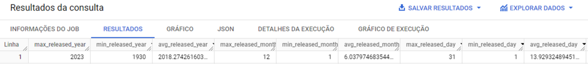

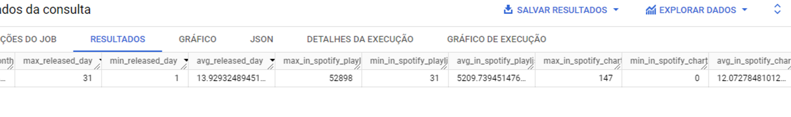

2.6.3- Consultei o MIN,MAX e AVG da tabela track_technal_info:

```sql
--track_technal_info
SELECT
    MAX(bpm) AS max_bpm,
    MIN(bpm) AS min_bpm,
    AVG(bpm) AS avg_bpm,
    MAX(danceability__) AS max_danceability__,
    MIN(danceability__) AS min_danceability__,
    AVG(danceability__) AS avg_danceability__,
    MAX(valence__) AS max_valence__,
    MIN(valence__) AS min_valence__,
    AVG(valence__) AS avg_valence__,
    MAX(energy__) AS max_energy__,
    MIN(energy__) AS min_energy__,
    AVG(energy__) AS avg_energy__,
    MAX(acousticness__) AS max_acousticness__,
    MIN(acousticness__) AS min_acousticness__,
    AVG(acousticness__) AS avg_acousticness__,
    MAX(instrumentalness__) AS max_instrumentalness__,
    MIN(instrumentalness__) AS min_instrumentalness__,
    AVG(instrumentalness__) AS avg_instrumentalness__,
    MAX(liveness__) AS max_liveness__,
    MIN(liveness__) AS min_liveness__,
    AVG(liveness__) AS avg_liveness__,
    MAX(speechiness__) AS max_speechiness__,
    MIN(speechiness__) AS min_speechiness__,
    AVG(speechiness__) AS avg_speechiness__,
   FROM `projeto-2-hipoteses-420623.projeto2.new_track_technal_info`
```


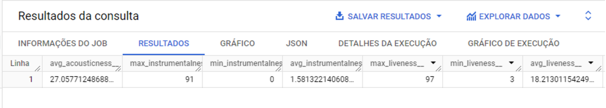


2.6.4- Consultei o MIN,MAX e AVG da tabela track_in_competion:

```sql
 ----track_in_competion
   SELECT
    MAX(in_apple_playlists) AS max_in_apple_playlists,
    MIN(in_apple_playlists) AS min_in_apple_playlists,
    AVG(in_apple_playlists) AS avg_in_apple_playlists,
    MAX(in_apple_charts) AS max_in_apple_charts,
    MIN(in_apple_charts) AS min_in_apple_charts,
    AVG(in_apple_charts) AS avg_in_apple_charts,
    MAX(in_deezer_playlists) AS max_in_deezer_playlists,
    MIN(in_deezer_playlists) AS min_in_deezer_playlists,
    AVG(in_deezer_playlists) AS avg_in_deezer_playlists,
    MAX(in_deezer_charts) AS max_in_deezer_charts,
    MIN(in_deezer_charts) AS min_in_deezer_charts,
    AVG(in_deezer_charts) AS avg_in_deezer_charts,
    FROM `projeto-2-hipoteses-420623.projeto2.new_track_in_competition`
```

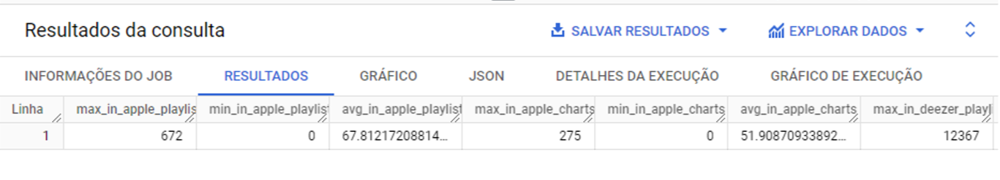

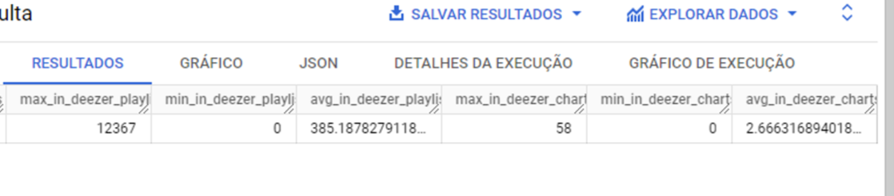

### 2.7- Verificar e alterar o tipo de dados

2.7.1- Após analisar que a variável streams estava em STRING  Criei uma nova tabela, e usei SAFE_CAST para transformá-la em INTEGER:

```sql
CREATE OR REPLACE TABLE `projeto-2-hipoteses-420623.projeto2.new3_track_in_spotify`
-- selecionando as colunas da tabela anterior
AS SELECT
track_id,
track_name,
artist_s__name,
artist_count,
released_year,
released_month,
released_day
in_spotify_playlists,
in_spotify_charts,
--usando SAFE_CAST para tornar streams em INTEGER
-- INT64 representa um número inteiro de 64 bits
SAFE_CAST(streams AS INT64) AS streams
FROM `projeto-2-hipoteses-420623.projeto2.new2_track_in_spotify`
```

### 2.8- Criar novas variáveis

2.8.1- Criei uma nova variável por release_date, onde somei e concatenei ano-mês-dia:

```sql
--criar novas variáveis
--data no formato ano-mês-dia
SELECT
  DATE(CONCAT(CAST(released_year AS STRING), "-", CAST(released_month AS STRING), "-", CAST(released_day AS STRING))) AS release_date,
  SUM(in_spotify_charts) AS total_in_spotify_charts,
  SUM(in_spotify_playlists) AS total_in_spotift_playlists
FROM 
  `projeto-2-hipoteses-420623.projeto2.new2_track_in_spotify`
GROUP BY 
  release_date;
```

### 2.9- Unir (join) as tabelas de dados

2.9.1- Abri um nova query, e use JOIN AS para uni-las. Para realizar esta etapa, pesquisei formulações do código no CHATGPT:

```sql
--unir tabelas
SELECT *
FROM `projeto-2-hipoteses-420623.projeto2.new3_track_in_spotify` AS t1
JOIN `projeto-2-hipoteses-420623.projeto2.new_track_technal_info` AS t2 ON t1.track_id = t2.track_id
JOIN `projeto-2-hipoteses-420623.projeto2.new_track_in_competition` AS t3 ON t1.track_id = t3.track_id;
```

### 2.10- Construir tabelas de dados auxiliares

2.10.1- Criei tabelas temporárias: 

```sql
--tabela temporaria
WITH teste AS (
  SELECT
    artist_s__name,
    COUNT(DISTINCT track_name) AS total_musicas,
    SUM(streams) AS total_streams

  FROM `projeto-2-hipoteses-420623.projeto2.new3_track_in_spotify`
  GROUP BY artist_s__name
)

SELECT *
FROM `projeto-2-hipoteses-420623.projeto2.new3_track_in_spotify` AS spotify

LEFT JOIN teste
ON spotify.artist_s__name = teste.artist_s__name;

```

2.10.2- Decidi unir dados como total de streams e total de artistas por musica, e exportei em uma nova tabela:

```sql
-- criar nova tabela
CREATE TABLE `projeto-2-hipoteses-420623.projeto2.totais_musicas_streams`
AS SELECT
    artist_s__name,
    COUNT(DISTINCT track_name) AS total_musicas,
    SUM(streams) AS total_streams

  FROM `projeto-2-hipoteses-420623.projeto2.new3_track_in_spotify`
  GROUP BY artist_s__name
```

2.10.3 - Fiz o mesmo com ou count de músicas por artista e unindo à uniao_tabelas:

```sql
--criando variavel: musicas por artista
--criando quartil pela variavel count musicas por artista
--contagem de musicas por artistas (passo 1)
SELECT
  artist_s__name,
  COUNT(track_id) AS track_count
FROM `projeto-2-hipoteses-420623.projeto2.uniao_tabelas`
GROUP BY artist_s__name;

--criar tabela com contagem de musicas/artistas como track_count(passo 2)
CREATE TABLE `projeto-2-hipoteses-420623.projeto2.track_count`
AS
SELECT
  artist_s__name,
  COUNT(track_id) AS track_count
FROM `projeto-2-hipoteses-420623.projeto2.uniao_tabelas`
GROUP BY artist_s__name;

--unir tabela track count a uniao_tabela (passo 3)
CREATE OR REPLACE TABLE `projeto2.uniao_tabelas`
AS
SELECT
  t1.*,
  t2.track_count
FROM `projeto-2-hipoteses-420623.projeto2.uniao_tabelas` AS t1
LEFT JOIN (
  SELECT 
    artist_s__name,
    COUNT(track_id) AS track_count
  FROM `projeto-2-hipoteses-420623.projeto2.uniao_tabelas`
  GROUP BY artist_s__name
) AS t2
ON t1.artist_s__name = t2.artist_s__name;
```

## **3. Fazer uma análise exploratória**

### 3.1- Pré

3.1.1- Conectei as informações da base de dados já tratadas pelo BigQuery ao Power BI seguindo passo a passo o seguinte vídeo: [https://www.youtube.com/watch?v=OPrjsidrXQI&t=94s](https://www.youtube.com/watch?v=OPrjsidrXQI&t=94s)

### 3.2- Agrupar dados de acordo com variáveis categóricas

3.2.1- Agrupei os dados partindo dos pedidos de análise do case, usando matrizes do Power BI:

- A) Músicas com BPM (Batidas Por Minuto) mais altos fazem mais sucesso em termos de número de streams no Spotify.
- B) As músicas mais populares no ranking do Spotify também possuem um comportamento semelhante em outras plataformas, como a Deezer.
- C) A presença de uma música em um maior número de playlists está correlacionada com um maior número de streams.
- D) Artistas com um maior número de músicas no Spotify têm mais streams.
- E) As características da música influenciam o sucesso em termos de número de streams no Spotify.

3.2.1-Formato das matrizes:

A) BPM x Streams:

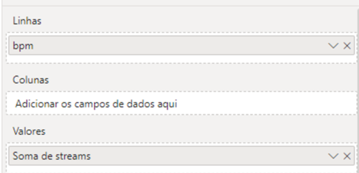

B) Charts: spotify/deezer/apple:

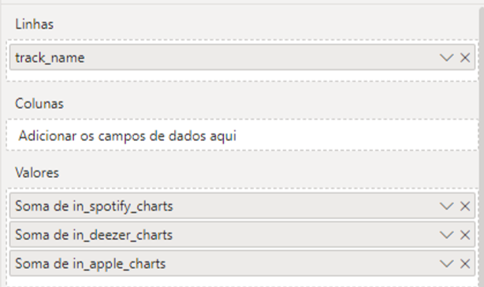

C) Streams x Playlists: 

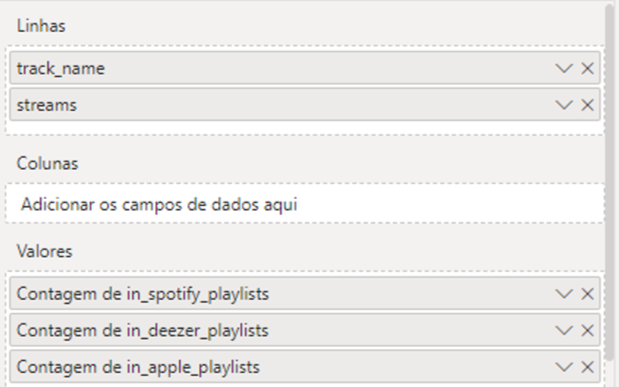

D)Contagem de músicas x streams: 

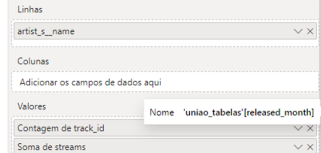

### 3.4. Visualizar variáveis categóricas

3.4.1- Criei gráficos de barra e linha no Power BI e visualizei como alguns deles já afirmam ou refutam as hipóteses. Como, alto BPM não garante que uma música tenha mais streams.

3.4.2- Um pouco das dificuldades com as visualizações: Essa base de dados traz alguns outliers. E tornam os números de streams muito discrepantes. Alguns na casa dos bilhões, outros na casa do milhares. Vejo que é necessário segmentar, para ter visualizações melhores, e comparar artistas com maiores números em suas categorias. 

### 3.5. Aplicar medidas de tendência central

3.5.1- A partir de matrizes, fui criando colunas com a soma, média, e, mediana. Decidi por aplicar as medidas de tendência central nas variáveis: streams, bpm, playlists, charts por artista, e, média de playlists por música. Minha página de matrizes ficou assim:

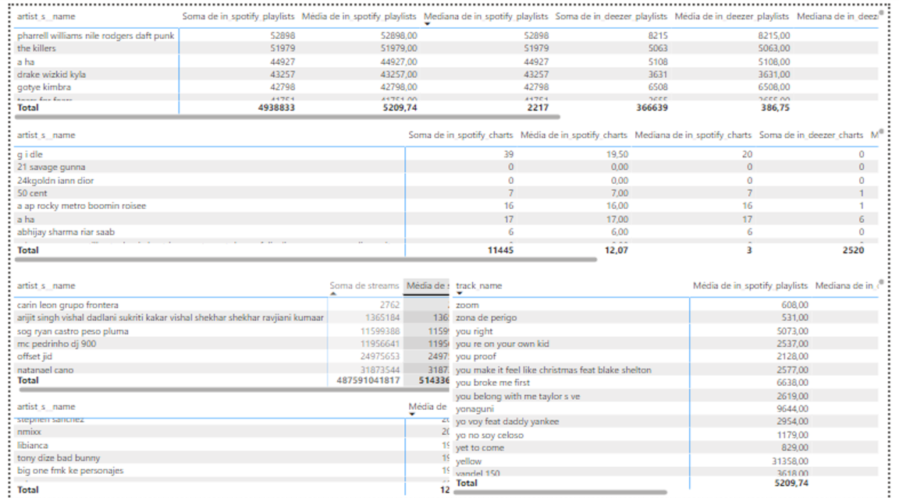

### 3.6. Visualizar a distribuição dos dados

3.6.1- Para visualizar a distribuição das variáveis foram usados histogramas; Para usá-los, é preciso instalar e acionar o python.

3.6.2- Com python já instalado e acionado no Power BI, foram criadas histogramas para as seguintes variáveis: streams, in_spotify_charts, in_spotify_playlists, bpm. Histogramas foram criados com o código no script python no power bi:

```python
# O código a seguir para criar um dataframe e remover as linhas duplicadas sempre é executado e age como um preâmbulo para o script: 

# dataset = pandas.DataFrame(undefined)
# dataset = dataset.drop_duplicates()

# Cole ou digite aqui seu código de script:

import matplotlib.pyplot as plt
import pandas as pd

# Obtenha os dados do Power BI - você só precisa alterar essas informações de todo o código
# Substitua 'dataset' pelo nome do seu DataFrame e 'YOUR VARIABLE' pelo nome da sua variável
data = dataset[['bpm']]

# Crie o histograma
plt.hist(data, bins=10, color='green', alpha=0.7)
plt.xlabel('Value')
plt.ylabel('Frequency')
plt.title('Histogram')

# Mostre o histograma
plt.show()

```

e os histogramas ficaram assim:

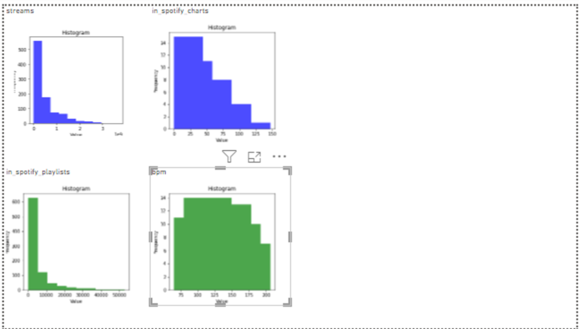

### 3.7. Aplicar medidas de dispersão

3.7.1- As medidas de dispersão usadas foram: Desvio padrão e variância. Ambas foram feitas diretamente no Power BI usando tabelas matriz:

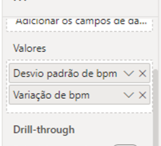

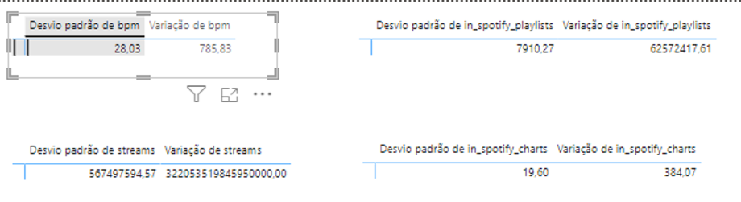

3.7.2- Conceitos importantes: 

**Desvio padrão**: O desvio padrão mede a que distância os valores individuais estão da média (média) de um conjunto de dados. Um desvio padrão mais alto indica maior dispersão.

**Variância**: A variância é o quadrado do desvio padrão. Ao elevar ao quadrado os desvios, os sinais positivos e negativos são eliminados, tornando-o útil para o cálculo. É outra medida de dispersão em torno da média.

Interpretação do desvio padrão:

**O desvio padrão é interpretado da seguinte forma:**

1. Quanto maior for o desvio padrão, maior será a dispersão dos dados. Isso significa que os valores individuais tendem a estar mais distantes da média. Portanto, um desvio padrão elevado indica maior variabilidade nos dados.

2. Quanto menor for o desvio padrão, menor será a dispersão dos dados. Isso significa que os valores individuais tendem a estar mais próximos da média. Um desvio padrão baixo indica menos variabilidade nos dados.

3. O desvio padrão pode ser interpretado como uma medida de risco ou incerteza em determinados contextos. Por exemplo, em finanças, um maior desvio padrão nos retornos de um investimento indica maior risco.

4. O desvio padrão é útil para comparar a dispersão entre diferentes conjuntos de dados. Pode ajudar a determinar qual dos dois conjuntos de dados tem maior variabilidade.

### 3.8.Visualizar o comportamento dos dados ao longo do tempo

3.8.1- Usando as ferramentas do Power BI, criei gráficos de linha, com eixo X release_date e eixo Y como SUM streams, COUNT track_id, COUNT artist_s__name, meus gráficos de tempo ficaram assim:

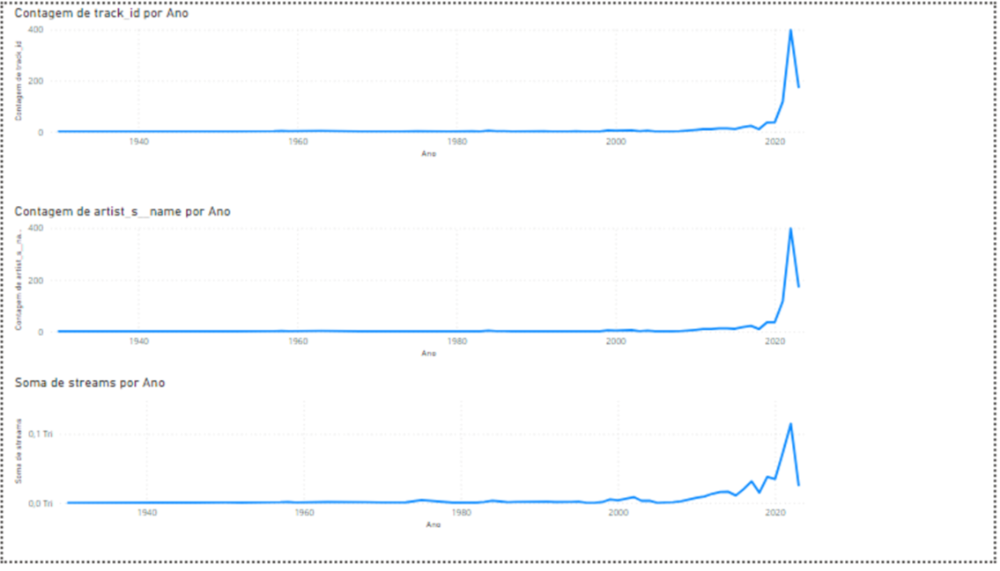

### 3.9. Calcular quartis, decis ou percentis

3.9.1- Decidi fazer passo a passo, criando novas tabelas por quartil e categoria para cada variável:

```sql
--criando tabela quartil:streams
CREATE OR REPLACE TABLE `projeto-2-hipoteses-420623.projeto2.quartil_streams`
AS
  SELECT streams,
  NTILE(4) OVER (ORDER BY streams) AS quartil_streams
  FROM `projeto-2-hipoteses-420623.projeto2.uniao_tabelas`;

--criando tabela quartil:track_count
CREATE TABLE `projeto-2-hipoteses-420623.projeto2.quartil_track_count`
AS
  SELECT track_count,
  NTILE(4) OVER (ORDER BY track_count) AS quartil_track_count
FROM `projeto2.uniao_tabelas`;

--criando tabela quartil: bpm
CREATE TABLE `projeto-2-hipoteses-420623.projeto2.quartil_bpm`
AS
  SELECT bpm,
  NTILE(4) OVER (ORDER BY bpm) AS quartil_bpm
FROM `projeto2.uniao_tabelas`;

--criando tabela quartil: spotify_playlists
CREATE TABLE `projeto-2-hipoteses-420623.projeto2.quartil_spotify_playlists`
AS
  SELECT in_spotify_playlists,
  NTILE(4) OVER (ORDER BY in_spotify_playlists) AS quartil_in_spotify_playlists
FROM `projeto2.uniao_tabelas`;

--categorizando os quartis:streams
SELECT
  streams,
  quartil_streams,
  IF(quartil_streams = 4, "alto", IF(quartil_streams = 3, "médio", "baixo")) AS categoria_streams
FROM `projeto2.quartil_streams`;

--categorizando os quartis:track_count
SELECT
  track_count,
  quartil_track_count,
  IF(quartil_track_count = 4, "alto", IF(quartil_track_count = 3, "médio", "baixo")) AS categoria_track_count
FROM `projeto2.quartil_track_count`;

--categorizando os quartis:bpm
SELECT
  bpm,
  quartil_bpm,
  IF (quartil_bpm IN(4,3),"alto", "baixo") AS categoria_bpm,
FROM`projeto2.quartil_bpm`;

--categorizando os quartis:spotify_playlists
SELECT
  in_spotify_playlists,
  quartil_in_spotify_playlists,
  IF(quartil_in_spotify_playlists = 4, "alto", "baixo") AS categoria_in_spotify_playlists,
FROM `projeto2.quartil_spotify_playlists`;
```

3.9.2- Depois uni cada uma delas a minha tabela principal nomeada uniao_tabelas:

```sql
--unindo tabela de categorias e quartis a tabela uniao_tabelas

--unindo quartil_streams e categoria_streams
CREATE OR REPLACE TABLE `projeto2.uniao_tabelas` AS
SELECT
  t1.*,
  t2.* EXCEPT (streams)
FROM `projeto2.uniao_tabelas` AS t1
LEFT JOIN `projeto2.categoria_streams` AS t2
ON t1.streams = t2.streams;

--unindo quartil_bpm e categoria_bpm
CREATE OR REPLACE TABLE `projeto2.uniao_tabelas` AS
SELECT
  t1.*,
  t2.* EXCEPT (bpm)
FROM `projeto2.uniao_tabelas` AS t1
LEFT JOIN `projeto2.categoria_bpm` AS t2
ON t1.bpm = t2.bpm;

--unindo quartil_in_spotify_playlists e categoria_in_spotify_playlists
CREATE OR REPLACE TABLE `projeto2.uniao_tabelas` AS
SELECT
  t1.*,
  t2.* EXCEPT(in_spotify_playlists)
FROM `projeto2.uniao_tabelas` AS t1
LEFT JOIN `projeto2.categoria_in_spotify_playlists` AS t2
ON t1.in_spotify_playlists = t2.in_spotify_playlists;

--unindo quartil_track_count e categoria_track_count
CREATE OR REPLACE TABLE `projeto2.uniao_tabelas` AS
SELECT
  t1.*,
  t2.* EXCEPT(track_count)
FROM `projeto2.uniao_tabelas` AS t1
LEFT JOIN `projeto2.categoria_track_count` AS t2
ON t1.track_count = t2.track_count;

```

### 3.10. Calcular correlação entre variáveis

3.10.1- Calculei as correlações:

```sql
-- calculando correlação de pearson

SELECT
CORR(streams,in_spotify_playlists) AS corr_spotify_playlists,
CORR(streams,in_spotify_charts) AS corr_spotfy_charts,
CORR(streams,in_deezer_playlists) AS corr_deezer_playlists,
CORR(streams,in_deezer_charts) AS corr_deezer_charts,
CORR(streams,in_apple_playlists) AS corr_apple_playlists,
CORR(streams,in_apple_charts) AS corr_apple_charts,
CORR (streams,danceability__) AS corr_danceability,
CORR(streams,energy__) AS corr_energy,
CORR(streams,liveness__) AS corr_liveness,
CORR(streams,bpm) AS corr_bpm,
CORR(streams,speechiness__) AS corr_speechiness,
CORR(streams,valence__) AS corr_valence,
CORR(streams,acousticness__) AS corr_acousticness,
CORR(streams,instrumentalness__) AS corr_instrumentalness
FROM `projeto2.uniao_tabelas`;

```

3.10.2- Resultados da correlação de Pearson:

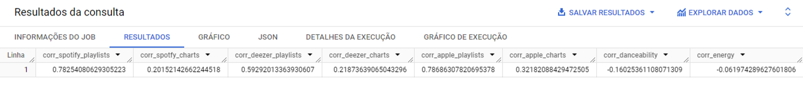

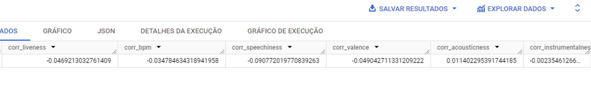

3.10.3- Correlação de Spearman:

```sql
--calculando correlaçao de spearman
WITH ranked_data AS (
  SELECT
    streams,
    in_spotify_charts,
    in_deezer_charts,
    in_apple_charts,
    RANK() OVER (ORDER BY streams) AS rank_streams,
    RANK() OVER (ORDER BY in_spotify_charts) AS rank_in_spotify_charts,
    RANK() OVER (ORDER BY in_deezer_charts) AS rank_in_deezer_charts,
    RANK() OVER (ORDER BY in_apple_charts) AS rank_in_apple_charts
  FROM
    `projeto2.uniao_tabelas`
)

SELECT
  --correlacao streams, spotify charts:
  CORR(rank_streams, rank_in_spotify_charts) AS spearman_corr_streams_spotify,
  IF(CORR(rank_streams, rank_in_spotify_charts) >= 0.5, "correlação alta", "correlação fraca") AS spotify_streams_valor_p,
 --correlacao streams, deezer charts
  CORR(rank_streams, rank_in_deezer_charts) AS spearman_corr_streams_deezer,
  IF(CORR(rank_streams, rank_in_deezer_charts) >= 0.5, "correlação alta", "correlação fraca") AS deezer_streams_valor_p,
  --correlacao streams, apple charts:
  CORR(rank_streams, rank_in_apple_charts) AS spearman_corr_streams_apple,
  IF(CORR(rank_streams, rank_in_apple_charts) >= 0.5, "correlação alta", "correlação fraca") AS apple_streams_valor_p,
  --correlacao spotify charts, deezer charts:
  CORR(rank_in_spotify_charts,rank_in_deezer_charts) AS spearman_corr_deezer_spotify_charts,
  IF(CORR(rank_in_spotify_charts,rank_in_deezer_charts) >= 0.5, "correlação alta", "correlação fraca") AS charts_deezer_spotify_valor_p,
  --correlacao spotify charts, apple charts:
  CORR(rank_in_spotify_charts,rank_in_apple_charts) AS spearman_corr_apple_spotify_charts,
  IF(CORR(rank_in_spotify_charts,rank_in_apple_charts) >= 0.5,"correlação alta", "correlação fraca") AS charts_apple_spotify_valor_p,
  --correlacao deezer charts, apple charts:
  CORR(rank_in_deezer_charts,rank_in_apple_charts) AS spearman_corr_apple_deezer_charts,
  IF(CORR(rank_in_deezer_charts,rank_in_apple_charts) >= 0.5,"correlação alta", "correlação fraca") AS charts_apple_deezer_valor_p
  FROM
  ranked_data;
```

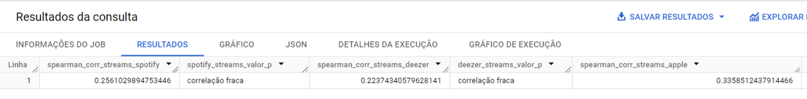

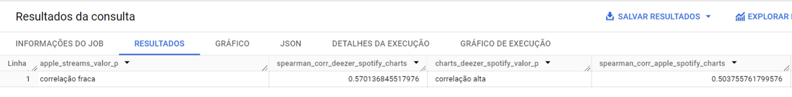


## **4. Aplicar técnica de análise**

### 4.1. Aplicar segmentação

4.1.1- Para segmentar meus dados pra uma análise, os separei por quartis, especificamente, o quartil de streams. Onde minha base de dados foi segmentada em 4 grupos, de acordo com o número de streams. Sabendo que, o 4 quartil é o que tem o maior número de streams. Minhas matrizes usaram como linha o quartil de 1 a 4, e, como valores, a média das variáveis:

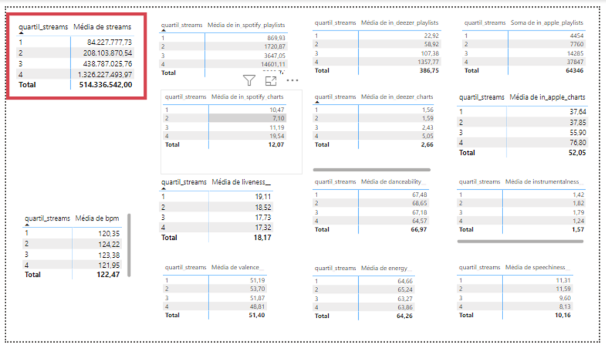

### 4.2. Realizar teste de significância

4.2.1- Para realizar o teste de significância, por se tratar da binaridade de grupos, precisei retornar a etapa de categorização, e retificá-la para apenas 2 grupos, na variável streams e também acrescentei mais uma variável in_spotify_charts:

```sql
--criando e categorizando streams
CREATE OR REPLACE TABLE `projeto-2-hipoteses-420623.projeto2.quartil_streams` AS
SELECT 
  track_id,
  streams,
  NTILE(4) OVER (ORDER BY streams) AS quartil_streams,
  IF(NTILE(4) OVER (ORDER BY streams) = 4, "alto", "baixo") AS categoria_streams
FROM 
  `projeto-2-hipoteses-420623.projeto2.uniao_tabelas`;

--criando e categorizando in_spotify_charts:
CREATE OR REPLACE TABLE `projeto-2-hipoteses-420623.projeto2.quartil_in_spotify_charts` AS
SELECT 
  track_id,
  in_spotify_charts,
  NTILE(4) OVER (ORDER BY in_spotify_charts) AS quartil_charts,
  IF(NTILE(4) OVER (ORDER BY in_spotify_charts) = 4, "alto", "baixo") AS categoria_charts
FROM 
  `projeto-2-hipoteses-420623.projeto2.uniao_tabelas`;
  
--atualizando tabela com as retificações de quatil e categoria
CREATE OR REPLACE TABLE `projeto2.uniao_tabelas` AS
SELECT
  t1.*,
  t2.quartil_streams,
  t2.categoria_streams,
  t3.quartil_charts,
  t3.categoria_charts
FROM `projeto2.uniao_tabelas` AS t1
LEFT JOIN `projeto2.quartil_streams` AS t2
ON t1.track_id = t2.track_id
LEFT JOIN `projeto2.quartil_in_spotify_charts` AS t3
ON t1.track_id = t3.track_id;
```

4.2.2- No Google Colab, após consultar a analisar sobre os dados, buscar referências, e consultar a IA. Cheguei a decisão de usar o teste Mannn Whitney U para analisar a primeira hipótese, que diz respeito as variáveis BPM e streams:

```python

# importar bibliotecas
import pandas as pd
from scipy.stats import mannwhitneyu

#carregar dados
df = pd.read_csv('/content/drive/MyDrive/bootcamp - laboratoria/projeto 2/hipotesis-laboratoria.csv')

# separe grupos em "alto" e "baixo"
df_alto = df[df['categoria_bpm'] == 'alto']["streams"]
df_baixo = df[df['categoria_bpm'] == 'baixo']["streams"]

# Execute o teste de Mann-Whitney U
estatistica, p_value = mannwhitneyu(df_alto, df_baixo, alternative="two-sided")

# Imprima os resultados
print(f"Mann-Whitney U statistic: {estatistica:.4f}")
print(f"P-value: {p_value:.4f}")

# Verifique se o p-value é significativo
if p_value < 0.05:
    print("Rejeite a hipótese nula: Há uma diferença significativa entre os grupos.")
else:
    print("Não rejeite a hipótese nula: Não há diferença significativa entre os grupos.")
```

### 4.3. Regressão linear

4.4.1- Aqui é possível acompanhar neste link passo a passo: 

[Google Colab](https://colab.research.google.com/drive/1DoGV9qHeNQFyMAKRSwS0yJI5cxyJN-h_?usp=sharing)

## 5. Conclusões e validação das hipóteses

5.1 - Músicas com BPM (Batidas Por Minuto) mais altos fazem mais sucesso em termos de número de streams no Spotify. Hipótese refutada. Ao realizar os testes, e observar os gráficos de dispersão.

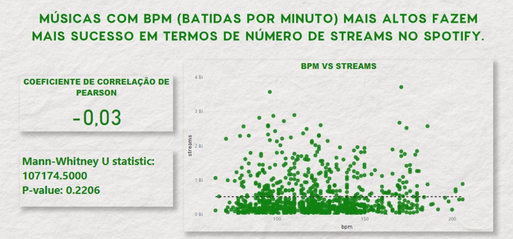

5.2- As músicas mais populares no ranking do Spotify também possuem um comportamento semelhante em outras plataformas, como a Deezer. Hipótese validada, temos sim comportamentos moderadamente semelhantes entre as plataforma.

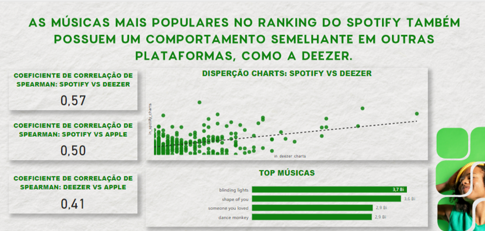

5.3- A presença de uma música em um maior número de playlists está correlacionada com um maior número de streams. Sim, hipotése validada. São 

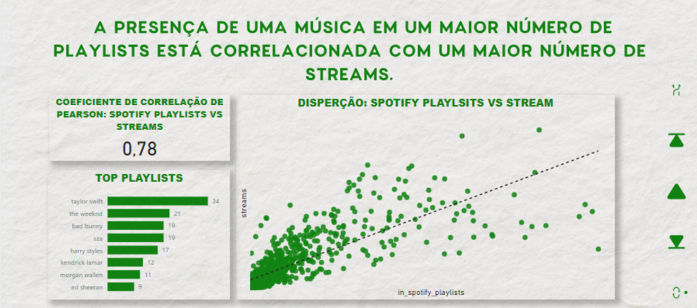

5.4- Artistas com um maior número de músicas no Spotify têm mais streams. Hipótese refutada. Além disso, artistas com streams tem músicas que alcançam mais números de streams do que artistas com grande número de músicas.

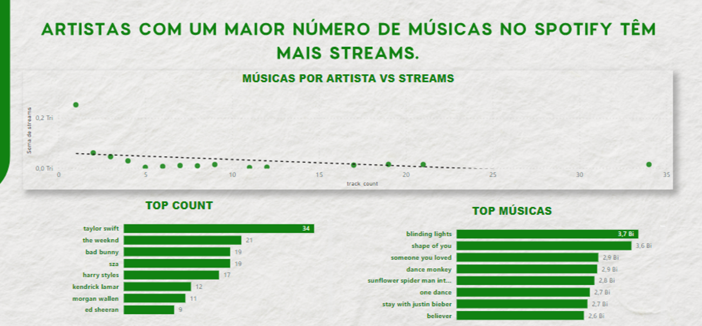

5.5- As características da música influenciam o sucesso em termos de número de streams no Spotify. Hipótese refutada. Os cálculos e gráficos mostram que não há correlação.

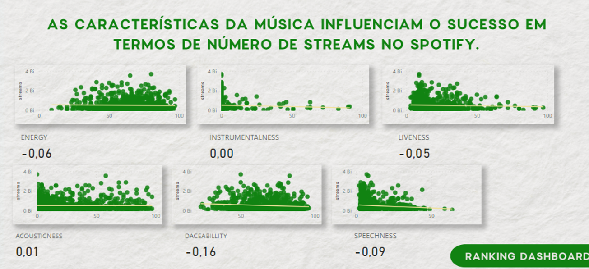
